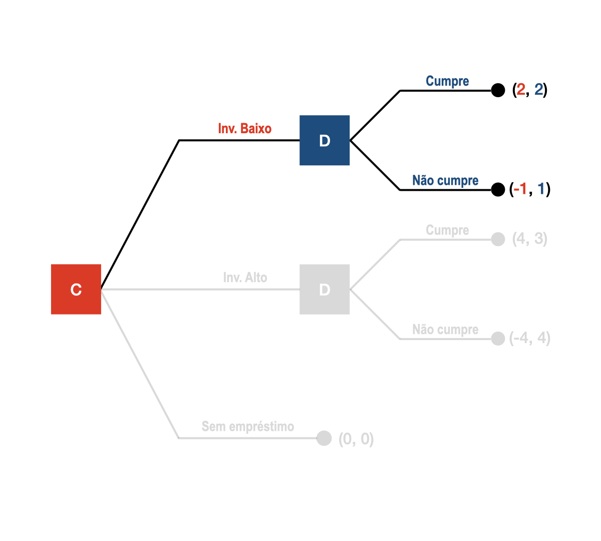
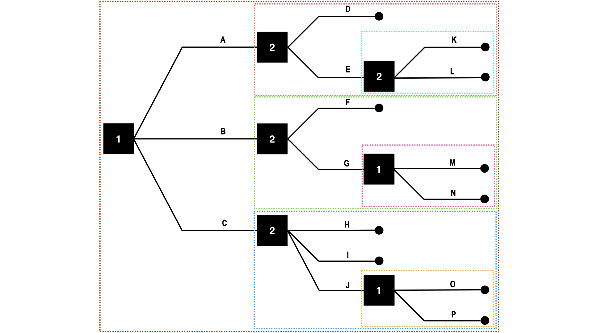
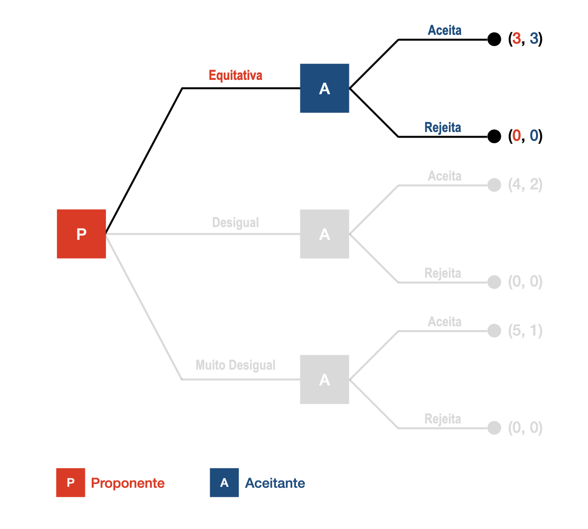
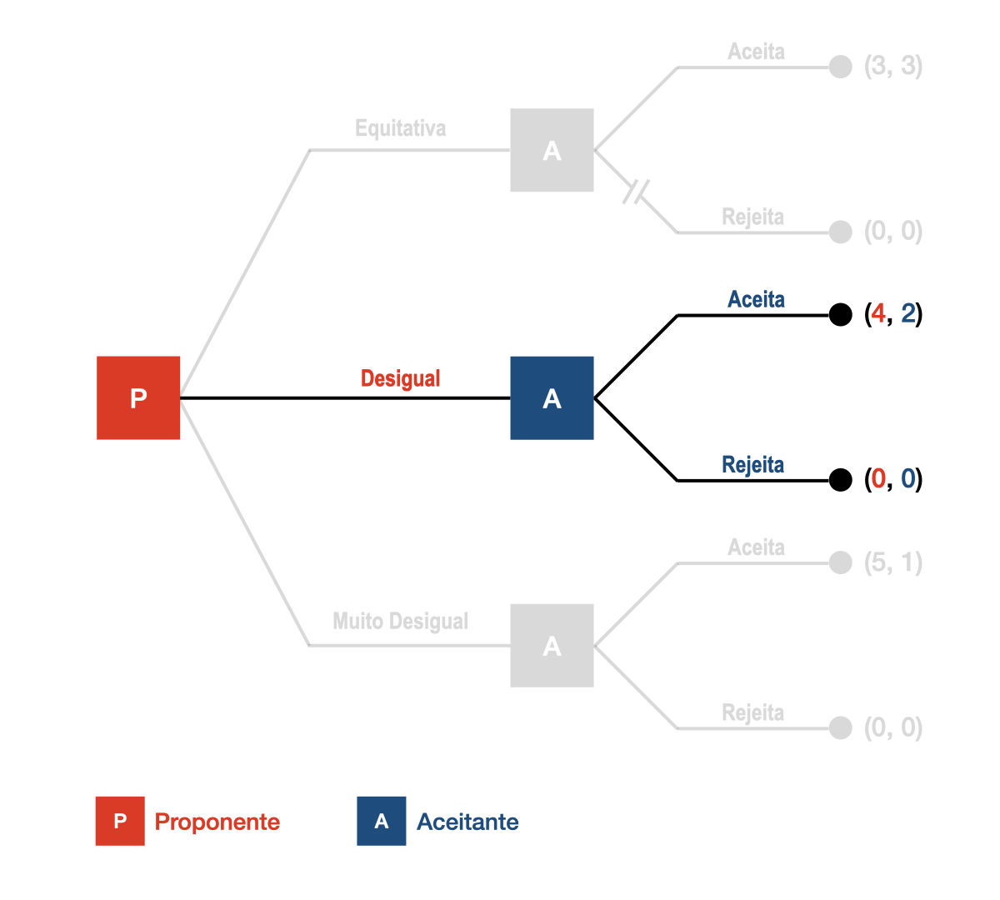
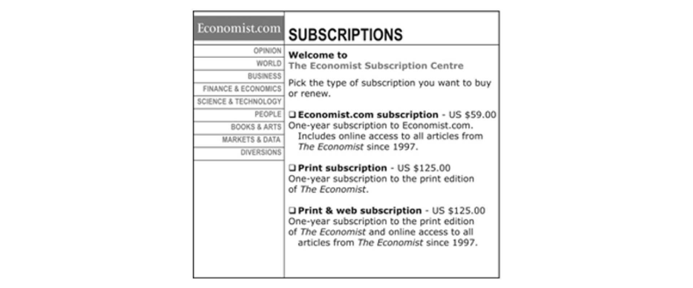

# Aula 10 – Jogos Sequenciais II
**Teoria da Decisão – 2023.1**
Lucas Thevenard

---
<!-- 
paginate: true 
header: Aula 10 – Jogos Sequenciais II
footer: lucas.gomes@fgv.br | 16/05/2023
-->

### Correção dos exercícios

---

### Questão 1, Jogo 1
 

<table>
  <tr class="game action player2"> 
    <td></td>
    <td>C</td>
    <td>D</td>
  </tr>
  <tr>
    <td class="game action player1" style="width: 180px;">A</td>
    <td class="game">(&nbsp;
      3, 
      3
    &nbsp;)</td>
    <td class="game">(&nbsp;
      -1, 
      -1
    &nbsp;)</td>
  </tr>
  <tr>
    <td class="game action player1">B</td>
    <td class="game">(&nbsp;
      -1, 
      -1
    &nbsp;)</td>
    <td class="game">(&nbsp;
      3, 
      3
    &nbsp;)</td>
  </tr>
</table>

---

### Questão 1, Jogo 1
 

<table>
  <tr class="game action player2"> 
    <td></td>
    <td>C</td>
    <td>D</td>
  </tr>
  <tr>
    <td class="game action player1" style="width: 180px;">A</td>
    <td class="game">(&nbsp;
      3, 
      3
    &nbsp;)</td>
    <td class="game">(&nbsp;
      -1, 
      -1
    &nbsp;)</td>
  </tr>
  <tr>
    <td class="game action player1">B</td>
    <td class="game">(&nbsp;
      -1, 
      -1
    &nbsp;)</td>
    <td class="game">(&nbsp;
      3, 
      3
    &nbsp;)</td>
  </tr>
</table>

---

### Questão 1, Jogo 1
 

<table>
  <tr class="game action player2"> 
    <td></td>
    <td>C</td>
    <td>D</td>
  </tr>
  <tr>
    <td class="game action player1" style="width: 180px;">A</td>
    <td class="game">(&nbsp;
      3, 
      3
    &nbsp;)</td>
    <td class="game">(&nbsp;
      -1, 
      -1
    &nbsp;)</td>
  </tr>
  <tr>
    <td class="game action player1">B</td>
    <td class="game">(&nbsp;
      -1, 
      -1
    &nbsp;)</td>
    <td class="game">(&nbsp;
      3, 
      3
    &nbsp;)</td>
  </tr>
</table>

---

### Questão 1, Jogo 1
 

<table>
  <tr class="game action player2"> 
    <td></td>
    <td>C</td>
    <td>D</td>
  </tr>
  <tr>
    <td class="game action player1" style="width: 180px;">A</td>
    <td class="game">(&nbsp;
      3, 
      3
    &nbsp;)</td>
    <td class="game">(&nbsp;
      -1, 
      -1
    &nbsp;)</td>
  </tr>
  <tr>
    <td class="game action player1">B</td>
    <td class="game">(&nbsp;
      -1, 
      -1
    &nbsp;)</td>
    <td class="game">(&nbsp;
      3, 
      3
    &nbsp;)</td>
  </tr>
</table>

---

### Questão 1, Jogo 1
 

<table>
  <tr class="game action player2"> 
    <td></td>
    <td>C</td>
    <td>D</td>
  </tr>
  <tr>
    <td class="game action player1" style="width: 180px;">A</td>
    <td class="game">(&nbsp;
      3, 
      3
    &nbsp;)</td>
    <td class="game">(&nbsp;
      -1, 
      -1
    &nbsp;)</td>
  </tr>
  <tr>
    <td class="game action player1">B</td>
    <td class="game">(&nbsp;
      -1, 
      -1
    &nbsp;)</td>
    <td class="game">(&nbsp;
      3, 
      3
    &nbsp;)</td>
  </tr>
</table>

---

### Questão 1, Jogo 1
 

<table>
  <tr class="game action player2"> 
    <td></td>
    <td>C</td>
    <td>D</td>
  </tr>
  <tr>
    <td class="game action player1" style="width: 180px;">A</td>
    <td class="game">(&nbsp;
      3, 
      3
    &nbsp;)</td>
    <td class="game">(&nbsp;
      -1, 
      -1
    &nbsp;)</td>
  </tr>
  <tr>
    <td class="game action player1">B</td>
    <td class="game">(&nbsp;
      -1, 
      -1
    &nbsp;)</td>
    <td class="game">(&nbsp;
      3, 
      3
    &nbsp;)</td>
  </tr>
</table>

---

### Questão 1, Jogo 1
 

<table>
  <tr class="game action player2"> 
    <td></td>
    <td>C</td>
    <td>D</td>
  </tr>
  <tr>
    <td class="game action player1" style="width: 180px;">A</td>
    <td class="game">(&nbsp;
      3, 
      3
    &nbsp;)</td>
    <td class="game">(&nbsp;
      -1, 
      -1
    &nbsp;)</td>
  </tr>
  <tr>
    <td class="game action player1">B</td>
    <td class="game">(&nbsp;
      -1, 
      -1
    &nbsp;)</td>
    <td class="game">(&nbsp;
      3, 
      3
    &nbsp;)</td>
  </tr>
</table>

---

### Questão 1, Jogo 1
 

<table>
  <tr class="game action player2"> 
    <td></td>
    <td>C</td>
    <td>D</td>
  </tr>
  <tr>
    <td class="game action player1" style="width: 180px;">A</td>
    <td class="game">(&nbsp;
      3, 
      3
    &nbsp;)</td>
    <td class="game">(&nbsp;
      -1, 
      -1
    &nbsp;)</td>
  </tr>
  <tr>
    <td class="game action player1">B</td>
    <td class="game">(&nbsp;
      -1, 
      -1
    &nbsp;)</td>
    <td class="game">(&nbsp;
      3, 
      3
    &nbsp;)</td>
  </tr>
</table>

 

#### Solução: **{ (A, C), (B, D) }**

---

## Características (Questão 1, Jogo 1)
* Dois equilíbrios de Nash
* Equilíbrios são ótimos de Pareto.
  * Melhores, para ambas os jogadores, do que as situações que não são equilíbrios.
  * Jogadores têm interesse em coordenar suas ações.
* Equilíbrios idênticos, igualmente benéficos para os jogadores.
* Que jogo é esse?
  * **Jogo de coordenação pura**.

---

### Questão 1, Jogo 2
 

<table>
  <tr class="game action player2"> 
    <td></td>
    <td>C</td>
    <td>D</td>
  </tr>
  <tr>
    <td class="game action player1" style="width: 180px;">A</td>
    <td class="game">(&nbsp;
      4, 
      -3
    &nbsp;)</td>
    <td class="game">(&nbsp;
      4, 
      4
    &nbsp;)</td>
  </tr>
  <tr>
    <td class="game action player1">B</td>
    <td class="game">(&nbsp;
      6, 
      6
    &nbsp;)</td>
    <td class="game">(&nbsp;
      -3, 
      4
    &nbsp;)</td>
  </tr>
</table>

---

### Questão 1, Jogo 2
 

<table>
  <tr class="game action player2"> 
    <td></td>
    <td>C</td>
    <td>D</td>
  </tr>
  <tr>
    <td class="game action player1" style="width: 180px;">A</td>
    <td class="game">(&nbsp;
      4, 
      -3
    &nbsp;)</td>
    <td class="game">(&nbsp;
      4, 
      4
    &nbsp;)</td>
  </tr>
  <tr>
    <td class="game action player1">B</td>
    <td class="game">(&nbsp;
      6, 
      6
    &nbsp;)</td>
    <td class="game">(&nbsp;
      -3, 
      4
    &nbsp;)</td>
  </tr>
</table>

---

### Questão 1, Jogo 2
 

<table>
  <tr class="game action player2"> 
    <td></td>
    <td>C</td>
    <td>D</td>
  </tr>
  <tr>
    <td class="game action player1" style="width: 180px;">A</td>
    <td class="game">(&nbsp;
      4, 
      -3
    &nbsp;)</td>
    <td class="game">(&nbsp;
      4, 
      4
    &nbsp;)</td>
  </tr>
  <tr>
    <td class="game action player1">B</td>
    <td class="game">(&nbsp;
      6, 
      6
    &nbsp;)</td>
    <td class="game">(&nbsp;
      -3, 
      4
    &nbsp;)</td>
  </tr>
</table>

---

### Questão 1, Jogo 2
 

<table>
  <tr class="game action player2"> 
    <td></td>
    <td>C</td>
    <td>D</td>
  </tr>
  <tr>
    <td class="game action player1" style="width: 180px;">A</td>
    <td class="game">(&nbsp;
      4, 
      -3
    &nbsp;)</td>
    <td class="game">(&nbsp;
      4, 
      4
    &nbsp;)</td>
  </tr>
  <tr>
    <td class="game action player1">B</td>
    <td class="game">(&nbsp;
      6, 
      6
    &nbsp;)</td>
    <td class="game">(&nbsp;
      -3, 
      4
    &nbsp;)</td>
  </tr>
</table>

---

### Questão 1, Jogo 2
 

<table>
  <tr class="game action player2"> 
    <td></td>
    <td>C</td>
    <td>D</td>
  </tr>
  <tr>
    <td class="game action player1" style="width: 180px;">A</td>
    <td class="game">(&nbsp;
      4, 
      -3
    &nbsp;)</td>
    <td class="game">(&nbsp;
      4, 
      4
    &nbsp;)</td>
  </tr>
  <tr>
    <td class="game action player1">B</td>
    <td class="game">(&nbsp;
      6, 
      6
    &nbsp;)</td>
    <td class="game">(&nbsp;
      -3, 
      4
    &nbsp;)</td>
  </tr>
</table>

---

### Questão 1, Jogo 2
 

<table>
  <tr class="game action player2"> 
    <td></td>
    <td>C</td>
    <td>D</td>
  </tr>
  <tr>
    <td class="game action player1" style="width: 180px;">A</td>
    <td class="game">(&nbsp;
      4, 
      -3
    &nbsp;)</td>
    <td class="game">(&nbsp;
      4, 
      4
    &nbsp;)</td>
  </tr>
  <tr>
    <td class="game action player1">B</td>
    <td class="game">(&nbsp;
      6, 
      6
    &nbsp;)</td>
    <td class="game">(&nbsp;
      -3, 
      4
    &nbsp;)</td>
  </tr>
</table>

---

### Questão 1, Jogo 2
 

<table>
  <tr class="game action player2"> 
    <td></td>
    <td>C</td>
    <td>D</td>
  </tr>
  <tr>
    <td class="game action player1" style="width: 180px;">A</td>
    <td class="game">(&nbsp;
      4, 
      -3
    &nbsp;)</td>
    <td class="game">(&nbsp;
      4, 
      4
    &nbsp;)</td>
  </tr>
  <tr>
    <td class="game action player1">B</td>
    <td class="game">(&nbsp;
      6, 
      6
    &nbsp;)</td>
    <td class="game">(&nbsp;
      -3, 
      4
    &nbsp;)</td>
  </tr>
</table>

---

### Questão 1, Jogo 2
 

<table>
  <tr class="game action player2"> 
    <td></td>
    <td>C</td>
    <td>D</td>
  </tr>
  <tr>
    <td class="game action player1" style="width: 180px;">A</td>
    <td class="game">(&nbsp;
      4, 
      -3
    &nbsp;)</td>
    <td class="game">(&nbsp;
      4, 
      4
    &nbsp;)</td>
  </tr>
  <tr>
    <td class="game action player1">B</td>
    <td class="game">(&nbsp;
      6, 
      6
    &nbsp;)</td>
    <td class="game">(&nbsp;
      -3, 
      4
    &nbsp;)</td>
  </tr>
</table>

 

#### Solução: **{ (A, D), (B, C) }**

---

## Características (Questão 1, Jogo 2)
* Dois equilíbrios de Nash
* Equilíbrios não são idênticos. Apenas um deles é ótimo de Pareto (B, C).
  * Apesar disso, cada jogador pode garantir um mínimo mais seguro adotando a estratégia que leva ao equilíbrio menos favorável.
  * Ou seja, para que o ótimo de Pareto seja obtido, cada parte deve confiar na outra.
* Que jogo é esse?
  * **Jogo da caça ao veado**.

---

### Questão 1, Jogo 3
 

<table>
  <tr class="game action player2"> 
    <td></td>
    <td>C</td>
    <td>D</td>
  </tr>
  <tr>
    <td class="game action player1" style="width: 180px;">A</td>
    <td class="game">(&nbsp;
      1, 
      1
    &nbsp;)</td>
    <td class="game">(&nbsp;
      2, 
      5
    &nbsp;)</td>
  </tr>
  <tr>
    <td class="game action player1">B</td>
    <td class="game">(&nbsp;
      5, 
      2
    &nbsp;)</td>
    <td class="game">(&nbsp;
      1, 
      1
    &nbsp;)</td>
  </tr>
</table>

---

### Questão 1, Jogo 3
 

<table>
  <tr class="game action player2"> 
    <td></td>
    <td>C</td>
    <td>D</td>
  </tr>
  <tr>
    <td class="game action player1" style="width: 180px;">A</td>
    <td class="game">(&nbsp;
      1, 
      1
    &nbsp;)</td>
    <td class="game">(&nbsp;
      2, 
      5
    &nbsp;)</td>
  </tr>
  <tr>
    <td class="game action player1">B</td>
    <td class="game">(&nbsp;
      5, 
      2
    &nbsp;)</td>
    <td class="game">(&nbsp;
      1, 
      1
    &nbsp;)</td>
  </tr>
</table>

---

### Questão 1, Jogo 3
 

<table>
  <tr class="game action player2"> 
    <td></td>
    <td>C</td>
    <td>D</td>
  </tr>
  <tr>
    <td class="game action player1" style="width: 180px;">A</td>
    <td class="game">(&nbsp;
      1, 
      1
    &nbsp;)</td>
    <td class="game">(&nbsp;
      2, 
      5
    &nbsp;)</td>
  </tr>
  <tr>
    <td class="game action player1">B</td>
    <td class="game">(&nbsp;
      5, 
      2
    &nbsp;)</td>
    <td class="game">(&nbsp;
      1, 
      1
    &nbsp;)</td>
  </tr>
</table>

---

### Questão 1, Jogo 3
 

<table>
  <tr class="game action player2"> 
    <td></td>
    <td>C</td>
    <td>D</td>
  </tr>
  <tr>
    <td class="game action player1" style="width: 180px;">A</td>
    <td class="game">(&nbsp;
      1, 
      1
    &nbsp;)</td>
    <td class="game">(&nbsp;
      2, 
      5
    &nbsp;)</td>
  </tr>
  <tr>
    <td class="game action player1">B</td>
    <td class="game">(&nbsp;
      5, 
      2
    &nbsp;)</td>
    <td class="game">(&nbsp;
      1, 
      1
    &nbsp;)</td>
  </tr>
</table>

---

### Questão 1, Jogo 3
 

<table>
  <tr class="game action player2"> 
    <td></td>
    <td>C</td>
    <td>D</td>
  </tr>
  <tr>
    <td class="game action player1" style="width: 180px;">A</td>
    <td class="game">(&nbsp;
      1, 
      1
    &nbsp;)</td>
    <td class="game">(&nbsp;
      2, 
      5
    &nbsp;)</td>
  </tr>
  <tr>
    <td class="game action player1">B</td>
    <td class="game">(&nbsp;
      5, 
      2
    &nbsp;)</td>
    <td class="game">(&nbsp;
      1, 
      1
    &nbsp;)</td>
  </tr>
</table>

---

### Questão 1, Jogo 3
 

<table>
  <tr class="game action player2"> 
    <td></td>
    <td>C</td>
    <td>D</td>
  </tr>
  <tr>
    <td class="game action player1" style="width: 180px;">A</td>
    <td class="game">(&nbsp;
      1, 
      1
    &nbsp;)</td>
    <td class="game">(&nbsp;
      2, 
      5
    &nbsp;)</td>
  </tr>
  <tr>
    <td class="game action player1">B</td>
    <td class="game">(&nbsp;
      5, 
      2
    &nbsp;)</td>
    <td class="game">(&nbsp;
      1, 
      1
    &nbsp;)</td>
  </tr>
</table>

---

### Questão 1, Jogo 3
 

<table>
  <tr class="game action player2"> 
    <td></td>
    <td>C</td>
    <td>D</td>
  </tr>
  <tr>
    <td class="game action player1" style="width: 180px;">A</td>
    <td class="game">(&nbsp;
      1, 
      1
    &nbsp;)</td>
    <td class="game">(&nbsp;
      2, 
      5
    &nbsp;)</td>
  </tr>
  <tr>
    <td class="game action player1">B</td>
    <td class="game">(&nbsp;
      5, 
      2
    &nbsp;)</td>
    <td class="game">(&nbsp;
      1, 
      1
    &nbsp;)</td>
  </tr>
</table>

---

### Questão 1, Jogo 3
 

<table>
  <tr class="game action player2"> 
    <td></td>
    <td>C</td>
    <td>D</td>
  </tr>
  <tr>
    <td class="game action player1" style="width: 180px;">A</td>
    <td class="game">(&nbsp;
      1, 
      1
    &nbsp;)</td>
    <td class="game">(&nbsp;
      2, 
      5
    &nbsp;)</td>
  </tr>
  <tr>
    <td class="game action player1">B</td>
    <td class="game">(&nbsp;
      5, 
      2
    &nbsp;)</td>
    <td class="game">(&nbsp;
      1, 
      1
    &nbsp;)</td>
  </tr>
</table>

 

#### Solução: **{ (A, D), (B, C) }**

---

## Características (Questão 1, Jogo 3)
* Dois equilíbrios de Nash
* Os dois são ótimos de Pareto.
  * Os equilíbrios são melhores do que as situações que não são equilíbrios.
  * Ambos os jogadores têm interesse em coordenar suas ações.
* Equilíbrios não são idênticos.
  * Cada equilíbrio favorece mais um jogador do que o outro.
  * Surge um potencial conflito distributivo: a coordenação favorecerá qual jogador?
* Que jogo é esse?
  * **Jogo da batalha dos sexos**.

---

### Questão 1, Jogo 4
 

<table>
  <tr class="game action player2"> 
    <td></td>
    <td>C</td>
    <td>D</td>
  </tr>
  <tr>
    <td class="game action player1" style="width: 180px;">A</td>
    <td class="game">(&nbsp;
      6, 
      0
    &nbsp;)</td>
    <td class="game">(&nbsp;
      3, 
      3
    &nbsp;)</td>
  </tr>
  <tr>
    <td class="game action player1">B</td>
    <td class="game">(&nbsp;
      4, 
      4
    &nbsp;)</td>
    <td class="game">(&nbsp;
      0, 
      6
    &nbsp;)</td>
  </tr>
</table>

---

### Questão 1, Jogo 4
 

<table>
  <tr class="game action player2"> 
    <td></td>
    <td>C</td>
    <td>D</td>
  </tr>
  <tr>
    <td class="game action player1" style="width: 180px;">A</td>
    <td class="game">(&nbsp;
      6, 
      0
    &nbsp;)</td>
    <td class="game">(&nbsp;
      3, 
      3
    &nbsp;)</td>
  </tr>
  <tr>
    <td class="game action player1">B</td>
    <td class="game">(&nbsp;
      4, 
      4
    &nbsp;)</td>
    <td class="game">(&nbsp;
      0, 
      6
    &nbsp;)</td>
  </tr>
</table>

---

### Questão 1, Jogo 4
 

<table>
  <tr class="game action player2"> 
    <td></td>
    <td>C</td>
    <td>D</td>
  </tr>
  <tr>
    <td class="game action player1" style="width: 180px;">A</td>
    <td class="game">(&nbsp;
      6, 
      0
    &nbsp;)</td>
    <td class="game">(&nbsp;
      3, 
      3
    &nbsp;)</td>
  </tr>
  <tr>
    <td class="game action player1">B</td>
    <td class="game">(&nbsp;
      4, 
      4
    &nbsp;)</td>
    <td class="game">(&nbsp;
      0, 
      6
    &nbsp;)</td>
  </tr>
</table>

---

### Questão 1, Jogo 4
 

<table>
  <tr class="game action player2"> 
    <td></td>
    <td>C</td>
    <td>D</td>
  </tr>
  <tr>
    <td class="game action player1" style="width: 180px;">A</td>
    <td class="game">(&nbsp;
      6, 
      0
    &nbsp;)</td>
    <td class="game">(&nbsp;
      3, 
      3
    &nbsp;)</td>
  </tr>
  <tr>
    <td class="game action player1">B</td>
    <td class="game">(&nbsp;
      4, 
      4
    &nbsp;)</td>
    <td class="game">(&nbsp;
      0, 
      6
    &nbsp;)</td>
  </tr>
</table>

---

### Questão 1, Jogo 4
 

<table>
  <tr class="game action player2"> 
    <td></td>
    <td>C</td>
    <td>D</td>
  </tr>
  <tr>
    <td class="game action player1" style="width: 180px;">A</td>
    <td class="game">(&nbsp;
      6, 
      0
    &nbsp;)</td>
    <td class="game">(&nbsp;
      3, 
      3
    &nbsp;)</td>
  </tr>
  <tr>
    <td class="game action player1">B</td>
    <td class="game">(&nbsp;
      4, 
      4
    &nbsp;)</td>
    <td class="game">(&nbsp;
      0, 
      6
    &nbsp;)</td>
  </tr>
</table>

---

### Questão 1, Jogo 4
 

<table>
  <tr class="game action player2"> 
    <td></td>
    <td>C</td>
    <td>D</td>
  </tr>
  <tr>
    <td class="game action player1" style="width: 180px;">A</td>
    <td class="game">(&nbsp;
      6, 
      0
    &nbsp;)</td>
    <td class="game">(&nbsp;
      3, 
      3
    &nbsp;)</td>
  </tr>
  <tr>
    <td class="game action player1">B</td>
    <td class="game">(&nbsp;
      4, 
      4
    &nbsp;)</td>
    <td class="game">(&nbsp;
      0, 
      6
    &nbsp;)</td>
  </tr>
</table>

---

### Questão 1, Jogo 4
 

<table>
  <tr class="game action player2"> 
    <td></td>
    <td>C</td>
    <td>D</td>
  </tr>
  <tr>
    <td class="game action player1" style="width: 180px;">A</td>
    <td class="game">(&nbsp;
      6, 
      0
    &nbsp;)</td>
    <td class="game">(&nbsp;
      3, 
      3
    &nbsp;)</td>
  </tr>
  <tr>
    <td class="game action player1">B</td>
    <td class="game">(&nbsp;
      4, 
      4
    &nbsp;)</td>
    <td class="game">(&nbsp;
      0, 
      6
    &nbsp;)</td>
  </tr>
</table>

---

### Questão 1, Jogo 4
 

<table>
  <tr class="game action player2"> 
    <td></td>
    <td>C</td>
    <td>D</td>
  </tr>
  <tr>
    <td class="game action player1" style="width: 180px;">A</td>
    <td class="game">(&nbsp;
      6, 
      0
    &nbsp;)</td>
    <td class="game">(&nbsp;
      3, 
      3
    &nbsp;)</td>
  </tr>
  <tr>
    <td class="game action player1">B</td>
    <td class="game">(&nbsp;
      4, 
      4
    &nbsp;)</td>
    <td class="game">(&nbsp;
      0, 
      6
    &nbsp;)</td>
  </tr>
</table>

 

#### Solução: **(A, D)**

---

## Características (Questão 1, Jogo 4)
* Apenas 1 equilíbrio de Nash.
  * Equilíbrio resulta de estratégias dominantes (solução forte).
* Equilíbrio não coincide com o ótimo de Pareto.
  * Os jogadores poderiam obter um resultado melhor para ambos caso cooperassem, no entanto os incentivos estratégicos são contrários à cooperação.
* Que jogo é esse?
  * **Dilema dos prisioneiros**.

---

### Questão 1, Jogo 5
 

<table>
  <tr class="game action player2"> 
    <td></td>
    <td>C</td>
    <td>D</td>
  </tr>
  <tr>
    <td class="game action player1" style="width: 180px;">A</td>
    <td class="game">(&nbsp;
      -1, 
      3
    &nbsp;)</td>
    <td class="game">(&nbsp;
      6, 
      6
    &nbsp;)</td>
  </tr>
  <tr>
    <td class="game action player1">B</td>
    <td class="game">(&nbsp;
      3, 
      3
    &nbsp;)</td>
    <td class="game">(&nbsp;
      3, 
      -1
    &nbsp;)</td>
  </tr>
</table>

---

### Questão 1, Jogo 5
 

<table>
  <tr class="game action player2"> 
    <td></td>
    <td>C</td>
    <td>D</td>
  </tr>
  <tr>
    <td class="game action player1" style="width: 180px;">A</td>
    <td class="game">(&nbsp;
      -1, 
      3
    &nbsp;)</td>
    <td class="game">(&nbsp;
      6, 
      6
    &nbsp;)</td>
  </tr>
  <tr>
    <td class="game action player1">B</td>
    <td class="game">(&nbsp;
      3, 
      3
    &nbsp;)</td>
    <td class="game">(&nbsp;
      3, 
      -1
    &nbsp;)</td>
  </tr>
</table>

---

### Questão 1, Jogo 5
 

<table>
  <tr class="game action player2"> 
    <td></td>
    <td>C</td>
    <td>D</td>
  </tr>
  <tr>
    <td class="game action player1" style="width: 180px;">A</td>
    <td class="game">(&nbsp;
      -1, 
      3
    &nbsp;)</td>
    <td class="game">(&nbsp;
      6, 
      6
    &nbsp;)</td>
  </tr>
  <tr>
    <td class="game action player1">B</td>
    <td class="game">(&nbsp;
      3, 
      3
    &nbsp;)</td>
    <td class="game">(&nbsp;
      3, 
      -1
    &nbsp;)</td>
  </tr>
</table>

---

### Questão 1, Jogo 5
 

<table>
  <tr class="game action player2"> 
    <td></td>
    <td>C</td>
    <td>D</td>
  </tr>
  <tr>
    <td class="game action player1" style="width: 180px;">A</td>
    <td class="game">(&nbsp;
      -1, 
      3
    &nbsp;)</td>
    <td class="game">(&nbsp;
      6, 
      6
    &nbsp;)</td>
  </tr>
  <tr>
    <td class="game action player1">B</td>
    <td class="game">(&nbsp;
      3, 
      3
    &nbsp;)</td>
    <td class="game">(&nbsp;
      3, 
      -1
    &nbsp;)</td>
  </tr>
</table>

---

### Questão 1, Jogo 5
 

<table>
  <tr class="game action player2"> 
    <td></td>
    <td>C</td>
    <td>D</td>
  </tr>
  <tr>
    <td class="game action player1" style="width: 180px;">A</td>
    <td class="game">(&nbsp;
      -1, 
      3
    &nbsp;)</td>
    <td class="game">(&nbsp;
      6, 
      6
    &nbsp;)</td>
  </tr>
  <tr>
    <td class="game action player1">B</td>
    <td class="game">(&nbsp;
      3, 
      3
    &nbsp;)</td>
    <td class="game">(&nbsp;
      3, 
      -1
    &nbsp;)</td>
  </tr>
</table>

---

### Questão 1, Jogo 5
 

<table>
  <tr class="game action player2"> 
    <td></td>
    <td>C</td>
    <td>D</td>
  </tr>
  <tr>
    <td class="game action player1" style="width: 180px;">A</td>
    <td class="game">(&nbsp;
      -1, 
      3
    &nbsp;)</td>
    <td class="game">(&nbsp;
      6, 
      6
    &nbsp;)</td>
  </tr>
  <tr>
    <td class="game action player1">B</td>
    <td class="game">(&nbsp;
      3, 
      3
    &nbsp;)</td>
    <td class="game">(&nbsp;
      3, 
      -1
    &nbsp;)</td>
  </tr>
</table>

---

### Questão 1, Jogo 5
 

<table>
  <tr class="game action player2"> 
    <td></td>
    <td>C</td>
    <td>D</td>
  </tr>
  <tr>
    <td class="game action player1" style="width: 180px;">A</td>
    <td class="game">(&nbsp;
      -1, 
      3
    &nbsp;)</td>
    <td class="game">(&nbsp;
      6, 
      6
    &nbsp;)</td>
  </tr>
  <tr>
    <td class="game action player1">B</td>
    <td class="game">(&nbsp;
      3, 
      3
    &nbsp;)</td>
    <td class="game">(&nbsp;
      3, 
      -1
    &nbsp;)</td>
  </tr>
</table>

---

### Questão 1, Jogo 5
 

<table>
  <tr class="game action player2"> 
    <td></td>
    <td>C</td>
    <td>D</td>
  </tr>
  <tr>
    <td class="game action player1" style="width: 180px;">A</td>
    <td class="game">(&nbsp;
      -1, 
      3
    &nbsp;)</td>
    <td class="game">(&nbsp;
      6, 
      6
    &nbsp;)</td>
  </tr>
  <tr>
    <td class="game action player1">B</td>
    <td class="game">(&nbsp;
      3, 
      3
    &nbsp;)</td>
    <td class="game">(&nbsp;
      3, 
      -1
    &nbsp;)</td>
  </tr>
</table>

 

#### Solução: **{ (A, D), (B, C) }**

---

## Características (Questão 1, Jogo 5)
* Dois equilíbrios de Nash
* Equilíbrios não são idênticos. Apenas um deles é ótimo de Pareto (A, D).
  * Apesar disso, cada jogador pode garantir um mínimo mais seguro adotando a estratégia que leva ao equilíbrio menos favorável.
  * Ou seja, para que o ótimo de Pareto seja obtido, cada parte deve confiar na outra.
* Que jogo é esse?
  * **Jogo da caça ao veado**.

---

### Questão 1, Jogo 6
 

<table>
  <tr class="game action player2"> 
    <td></td>
    <td>C</td>
    <td>D</td>
  </tr>
  <tr>
    <td class="game action player1" style="width: 180px;">A</td>
    <td class="game">(&nbsp;
      2, 
      2
    &nbsp;)</td>
    <td class="game">(&nbsp;
      0, 
      4
    &nbsp;)</td>
  </tr>
  <tr>
    <td class="game action player1">B</td>
    <td class="game">(&nbsp;
      4, 
      0
    &nbsp;)</td>
    <td class="game">(&nbsp;
      -3, 
      -3
    &nbsp;)</td>
  </tr>
</table>

---

### Questão 1, Jogo 6
 

<table>
  <tr class="game action player2"> 
    <td></td>
    <td>C</td>
    <td>D</td>
  </tr>
  <tr>
    <td class="game action player1" style="width: 180px;">A</td>
    <td class="game">(&nbsp;
      2, 
      2
    &nbsp;)</td>
    <td class="game">(&nbsp;
      0, 
      4
    &nbsp;)</td>
  </tr>
  <tr>
    <td class="game action player1">B</td>
    <td class="game">(&nbsp;
      4, 
      0
    &nbsp;)</td>
    <td class="game">(&nbsp;
      -3, 
      -3
    &nbsp;)</td>
  </tr>
</table>

---

### Questão 1, Jogo 6
 

<table>
  <tr class="game action player2"> 
    <td></td>
    <td>C</td>
    <td>D</td>
  </tr>
  <tr>
    <td class="game action player1" style="width: 180px;">A</td>
    <td class="game">(&nbsp;
      2, 
      2
    &nbsp;)</td>
    <td class="game">(&nbsp;
      0, 
      4
    &nbsp;)</td>
  </tr>
  <tr>
    <td class="game action player1">B</td>
    <td class="game">(&nbsp;
      4, 
      0
    &nbsp;)</td>
    <td class="game">(&nbsp;
      -3, 
      -3
    &nbsp;)</td>
  </tr>
</table>

---

### Questão 1, Jogo 6
 

<table>
  <tr class="game action player2"> 
    <td></td>
    <td>C</td>
    <td>D</td>
  </tr>
  <tr>
    <td class="game action player1" style="width: 180px;">A</td>
    <td class="game">(&nbsp;
      2, 
      2
    &nbsp;)</td>
    <td class="game">(&nbsp;
      0, 
      4
    &nbsp;)</td>
  </tr>
  <tr>
    <td class="game action player1">B</td>
    <td class="game">(&nbsp;
      4, 
      0
    &nbsp;)</td>
    <td class="game">(&nbsp;
      -3, 
      -3
    &nbsp;)</td>
  </tr>
</table>

---

### Questão 1, Jogo 6
 

<table>
  <tr class="game action player2"> 
    <td></td>
    <td>C</td>
    <td>D</td>
  </tr>
  <tr>
    <td class="game action player1" style="width: 180px;">A</td>
    <td class="game">(&nbsp;
      2, 
      2
    &nbsp;)</td>
    <td class="game">(&nbsp;
      0, 
      4
    &nbsp;)</td>
  </tr>
  <tr>
    <td class="game action player1">B</td>
    <td class="game">(&nbsp;
      4, 
      0
    &nbsp;)</td>
    <td class="game">(&nbsp;
      -3, 
      -3
    &nbsp;)</td>
  </tr>
</table>

---

### Questão 1, Jogo 6
 

<table>
  <tr class="game action player2"> 
    <td></td>
    <td>C</td>
    <td>D</td>
  </tr>
  <tr>
    <td class="game action player1" style="width: 180px;">A</td>
    <td class="game">(&nbsp;
      2, 
      2
    &nbsp;)</td>
    <td class="game">(&nbsp;
      0, 
      4
    &nbsp;)</td>
  </tr>
  <tr>
    <td class="game action player1">B</td>
    <td class="game">(&nbsp;
      4, 
      0
    &nbsp;)</td>
    <td class="game">(&nbsp;
      -3, 
      -3
    &nbsp;)</td>
  </tr>
</table>

---

### Questão 1, Jogo 6
 

<table>
  <tr class="game action player2"> 
    <td></td>
    <td>C</td>
    <td>D</td>
  </tr>
  <tr>
    <td class="game action player1" style="width: 180px;">A</td>
    <td class="game">(&nbsp;
      2, 
      2
    &nbsp;)</td>
    <td class="game">(&nbsp;
      0, 
      4
    &nbsp;)</td>
  </tr>
  <tr>
    <td class="game action player1">B</td>
    <td class="game">(&nbsp;
      4, 
      0
    &nbsp;)</td>
    <td class="game">(&nbsp;
      -3, 
      -3
    &nbsp;)</td>
  </tr>
</table>

---

### Questão 1, Jogo 6
 

<table>
  <tr class="game action player2"> 
    <td></td>
    <td>C</td>
    <td>D</td>
  </tr>
  <tr>
    <td class="game action player1" style="width: 180px;">A</td>
    <td class="game">(&nbsp;
      2, 
      2
    &nbsp;)</td>
    <td class="game">(&nbsp;
      0, 
      4
    &nbsp;)</td>
  </tr>
  <tr>
    <td class="game action player1">B</td>
    <td class="game">(&nbsp;
      4, 
      0
    &nbsp;)</td>
    <td class="game">(&nbsp;
      -3, 
      -3
    &nbsp;)</td>
  </tr>
</table>

 

#### Solução: **{ (A, D), (B, C) }**

---

## Características (Questão 1, Jogo 6)
* Dois equilíbrios de Nash
* Equilíbrios não são idênticos. 
  * Em cada equilíbrio, um jogador adota a estratégia "agressiva" e outro adota a estratégia "passiva".
  * Cada equilíbrio favorece o jogador que adotou a estratégia "agressiva".
  * No entanto, se ambos tentam obter o melhor valor e adotam a estratégia agressiva, o resultado é o pior para ambos.
* Que jogo é esse?
  * **Jogo da galinha**.

---

### Questão 2, Jogo A
 

<table>
  <tr class="game action player2"> 
    <td></td>
    <td>E</td>
    <td>F</td>
    <td>G</td>
    <td>H</td>
  </tr>
  <tr>
    <td class="game action player1" style="width: 80px;">A</td>
    <td class="game">(&nbsp;
      2, 
      2
    &nbsp;)</td>
    <td class="game">(&nbsp;
      0, 
      4
    &nbsp;)</td>
    <td class="game">(&nbsp;
      10, 
      5
    &nbsp;)</td>
    <td class="game">(&nbsp;
      1, 
      3
    &nbsp;)</td>
  </tr>
  <tr>
    <td class="game action player1">B</td>
    <td class="game">(&nbsp;
      4, 
      0
    &nbsp;)</td>
    <td class="game">(&nbsp;
      -3, 
      -3
    &nbsp;)</td>
    <td class="game">(&nbsp;
      3, 
      5
    &nbsp;)</td>
    <td class="game">(&nbsp;
      1, 
      6
    &nbsp;)</td>
  </tr>
  <tr>
    <td class="game action player1">C</td>
    <td class="game">(&nbsp;
      1, 
      3
    &nbsp;)</td>
    <td class="game">(&nbsp;
      4, 
      5
    &nbsp;)</td>
    <td class="game">(&nbsp;
      5, 
      2
    &nbsp;)</td>
    <td class="game">(&nbsp;
      6, 
      -2
    &nbsp;)</td>
  </tr>
  <tr>
    <td class="game action player1">D</td>
    <td class="game">(&nbsp;
      1, 
      3
    &nbsp;)</td>
    <td class="game">(&nbsp;
      1, 
      -2
    &nbsp;)</td>
    <td class="game">(&nbsp;
      0, 
      5
    &nbsp;)</td>
    <td class="game">(&nbsp;
      6, 
      5
    &nbsp;)</td>
  </tr>
</table>

---

### Questão 2, Jogo A
 

<table>
  <tr class="game action player2"> 
    <td></td>
    <td>E</td>
    <td>F</td>
    <td>G</td>
    <td>H</td>
  </tr>
  <tr>
    <td class="game action player1" style="width: 80px;">A</td>
    <td class="game">(&nbsp;
      2, 
      2
    &nbsp;)</td>
    <td class="game">(&nbsp;
      0, 
      4
    &nbsp;)</td>
    <td class="game">(&nbsp;
      10, 
      5
    &nbsp;)</td>
    <td class="game">(&nbsp;
      1, 
      3
    &nbsp;)</td>
  </tr>
  <tr>
    <td class="game action player1">B</td>
    <td class="game">(&nbsp;
      4, 
      0
    &nbsp;)</td>
    <td class="game">(&nbsp;
      -3, 
      -3
    &nbsp;)</td>
    <td class="game">(&nbsp;
      3, 
      5
    &nbsp;)</td>
    <td class="game">(&nbsp;
      1, 
      6
    &nbsp;)</td>
  </tr>
  <tr>
    <td class="game action player1">C</td>
    <td class="game">(&nbsp;
      1, 
      3
    &nbsp;)</td>
    <td class="game">(&nbsp;
      4, 
      5
    &nbsp;)</td>
    <td class="game">(&nbsp;
      5, 
      2
    &nbsp;)</td>
    <td class="game">(&nbsp;
      6, 
      -2
    &nbsp;)</td>
  </tr>
  <tr>
    <td class="game action player1">D</td>
    <td class="game">(&nbsp;
      1, 
      3
    &nbsp;)</td>
    <td class="game">(&nbsp;
      1, 
      -2
    &nbsp;)</td>
    <td class="game">(&nbsp;
      0, 
      5
    &nbsp;)</td>
    <td class="game">(&nbsp;
      6, 
      5
    &nbsp;)</td>
  </tr>
</table>

---

### Questão 2, Jogo A
 

<table>
  <tr class="game action player2"> 
    <td></td>
    <td>E</td>
    <td>F</td>
    <td>G</td>
    <td>H</td>
  </tr>
  <tr>
    <td class="game action player1" style="width: 80px;">A</td>
    <td class="game">(&nbsp;
      2, 
      2
    &nbsp;)</td>
    <td class="game">(&nbsp;
      0, 
      4
    &nbsp;)</td>
    <td class="game">(&nbsp;
      10, 
      5
    &nbsp;)</td>
    <td class="game">(&nbsp;
      1, 
      3
    &nbsp;)</td>
  </tr>
  <tr>
    <td class="game action player1">B</td>
    <td class="game">(&nbsp;
      4, 
      0
    &nbsp;)</td>
    <td class="game">(&nbsp;
      -3, 
      -3
    &nbsp;)</td>
    <td class="game">(&nbsp;
      3, 
      5
    &nbsp;)</td>
    <td class="game">(&nbsp;
      1, 
      6
    &nbsp;)</td>
  </tr>
  <tr>
    <td class="game action player1">C</td>
    <td class="game">(&nbsp;
      1, 
      3
    &nbsp;)</td>
    <td class="game">(&nbsp;
      4, 
      5
    &nbsp;)</td>
    <td class="game">(&nbsp;
      5, 
      2
    &nbsp;)</td>
    <td class="game">(&nbsp;
      6, 
      -2
    &nbsp;)</td>
  </tr>
  <tr>
    <td class="game action player1">D</td>
    <td class="game">(&nbsp;
      1, 
      3
    &nbsp;)</td>
    <td class="game">(&nbsp;
      1, 
      -2
    &nbsp;)</td>
    <td class="game">(&nbsp;
      0, 
      5
    &nbsp;)</td>
    <td class="game">(&nbsp;
      6, 
      5
    &nbsp;)</td>
  </tr>
</table>

---

### Questão 2, Jogo A
 

<table>
  <tr class="game action player2"> 
    <td></td>
    <td>E</td>
    <td>F</td>
    <td>G</td>
    <td>H</td>
  </tr>
  <tr>
    <td class="game action player1" style="width: 80px;">A</td>
    <td class="game">(&nbsp;
      2, 
      2
    &nbsp;)</td>
    <td class="game">(&nbsp;
      0, 
      4
    &nbsp;)</td>
    <td class="game">(&nbsp;
      10, 
      5
    &nbsp;)</td>
    <td class="game">(&nbsp;
      1, 
      3
    &nbsp;)</td>
  </tr>
  <tr>
    <td class="game action player1">B</td>
    <td class="game">(&nbsp;
      4, 
      0
    &nbsp;)</td>
    <td class="game">(&nbsp;
      -3, 
      -3
    &nbsp;)</td>
    <td class="game">(&nbsp;
      3, 
      5
    &nbsp;)</td>
    <td class="game">(&nbsp;
      1, 
      6
    &nbsp;)</td>
  </tr>
  <tr>
    <td class="game action player1">C</td>
    <td class="game">(&nbsp;
      1, 
      3
    &nbsp;)</td>
    <td class="game">(&nbsp;
      4, 
      5
    &nbsp;)</td>
    <td class="game">(&nbsp;
      5, 
      2
    &nbsp;)</td>
    <td class="game">(&nbsp;
      6, 
      -2
    &nbsp;)</td>
  </tr>
  <tr>
    <td class="game action player1">D</td>
    <td class="game">(&nbsp;
      1, 
      3
    &nbsp;)</td>
    <td class="game">(&nbsp;
      1, 
      -2
    &nbsp;)</td>
    <td class="game">(&nbsp;
      0, 
      5
    &nbsp;)</td>
    <td class="game">(&nbsp;
      6, 
      5
    &nbsp;)</td>
  </tr>
</table>

---

### Questão 2, Jogo A
 

<table>
  <tr class="game action player2"> 
    <td></td>
    <td>E</td>
    <td>F</td>
    <td>G</td>
    <td>H</td>
  </tr>
  <tr>
    <td class="game action player1" style="width: 80px;">A</td>
    <td class="game">(&nbsp;
      2, 
      2
    &nbsp;)</td>
    <td class="game">(&nbsp;
      0, 
      4
    &nbsp;)</td>
    <td class="game">(&nbsp;
      10, 
      5
    &nbsp;)</td>
    <td class="game">(&nbsp;
      1, 
      3
    &nbsp;)</td>
  </tr>
  <tr>
    <td class="game action player1">B</td>
    <td class="game">(&nbsp;
      4, 
      0
    &nbsp;)</td>
    <td class="game">(&nbsp;
      -3, 
      -3
    &nbsp;)</td>
    <td class="game">(&nbsp;
      3, 
      5
    &nbsp;)</td>
    <td class="game">(&nbsp;
      1, 
      6
    &nbsp;)</td>
  </tr>
  <tr>
    <td class="game action player1">C</td>
    <td class="game">(&nbsp;
      1, 
      3
    &nbsp;)</td>
    <td class="game">(&nbsp;
      4, 
      5
    &nbsp;)</td>
    <td class="game">(&nbsp;
      5, 
      2
    &nbsp;)</td>
    <td class="game">(&nbsp;
      6, 
      -2
    &nbsp;)</td>
  </tr>
  <tr>
    <td class="game action player1">D</td>
    <td class="game">(&nbsp;
      1, 
      3
    &nbsp;)</td>
    <td class="game">(&nbsp;
      1, 
      -2
    &nbsp;)</td>
    <td class="game">(&nbsp;
      0, 
      5
    &nbsp;)</td>
    <td class="game">(&nbsp;
      6, 
      5
    &nbsp;)</td>
  </tr>
</table>

---

### Questão 2, Jogo A
 

<table>
  <tr class="game action player2"> 
    <td></td>
    <td>E</td>
    <td>F</td>
    <td>G</td>
    <td>H</td>
  </tr>
  <tr>
    <td class="game action player1" style="width: 80px;">A</td>
    <td class="game">(&nbsp;
      2, 
      2
    &nbsp;)</td>
    <td class="game">(&nbsp;
      0, 
      4
    &nbsp;)</td>
    <td class="game">(&nbsp;
      10, 
      5
    &nbsp;)</td>
    <td class="game">(&nbsp;
      1, 
      3
    &nbsp;)</td>
  </tr>
  <tr>
    <td class="game action player1">B</td>
    <td class="game">(&nbsp;
      4, 
      0
    &nbsp;)</td>
    <td class="game">(&nbsp;
      -3, 
      -3
    &nbsp;)</td>
    <td class="game">(&nbsp;
      3, 
      5
    &nbsp;)</td>
    <td class="game">(&nbsp;
      1, 
      6
    &nbsp;)</td>
  </tr>
  <tr>
    <td class="game action player1">C</td>
    <td class="game">(&nbsp;
      1, 
      3
    &nbsp;)</td>
    <td class="game">(&nbsp;
      4, 
      5
    &nbsp;)</td>
    <td class="game">(&nbsp;
      5, 
      2
    &nbsp;)</td>
    <td class="game">(&nbsp;
      6, 
      -2
    &nbsp;)</td>
  </tr>
  <tr>
    <td class="game action player1">D</td>
    <td class="game">(&nbsp;
      1, 
      3
    &nbsp;)</td>
    <td class="game">(&nbsp;
      1, 
      -2
    &nbsp;)</td>
    <td class="game">(&nbsp;
      0, 
      5
    &nbsp;)</td>
    <td class="game">(&nbsp;
      6, 
      5
    &nbsp;)</td>
  </tr>
</table>

---

### Questão 2, Jogo A
 

<table>
  <tr class="game action player2"> 
    <td></td>
    <td>E</td>
    <td>F</td>
    <td>G</td>
    <td>H</td>
  </tr>
  <tr>
    <td class="game action player1" style="width: 80px;">A</td>
    <td class="game">(&nbsp;
      2, 
      2
    &nbsp;)</td>
    <td class="game">(&nbsp;
      0, 
      4
    &nbsp;)</td>
    <td class="game">(&nbsp;
      10, 
      5
    &nbsp;)</td>
    <td class="game">(&nbsp;
      1, 
      3
    &nbsp;)</td>
  </tr>
  <tr>
    <td class="game action player1">B</td>
    <td class="game">(&nbsp;
      4, 
      0
    &nbsp;)</td>
    <td class="game">(&nbsp;
      -3, 
      -3
    &nbsp;)</td>
    <td class="game">(&nbsp;
      3, 
      5
    &nbsp;)</td>
    <td class="game">(&nbsp;
      1, 
      6
    &nbsp;)</td>
  </tr>
  <tr>
    <td class="game action player1">C</td>
    <td class="game">(&nbsp;
      1, 
      3
    &nbsp;)</td>
    <td class="game">(&nbsp;
      4, 
      5
    &nbsp;)</td>
    <td class="game">(&nbsp;
      5, 
      2
    &nbsp;)</td>
    <td class="game">(&nbsp;
      6, 
      -2
    &nbsp;)</td>
  </tr>
  <tr>
    <td class="game action player1">D</td>
    <td class="game">(&nbsp;
      1, 
      3
    &nbsp;)</td>
    <td class="game">(&nbsp;
      1, 
      -2
    &nbsp;)</td>
    <td class="game">(&nbsp;
      0, 
      5
    &nbsp;)</td>
    <td class="game">(&nbsp;
      6, 
      5
    &nbsp;)</td>
  </tr>
</table>

---

### Questão 2, Jogo A
 

<table>
  <tr class="game action player2"> 
    <td></td>
    <td>E</td>
    <td>F</td>
    <td>G</td>
    <td>H</td>
  </tr>
  <tr>
    <td class="game action player1" style="width: 80px;">A</td>
    <td class="game">(&nbsp;
      2, 
      2
    &nbsp;)</td>
    <td class="game">(&nbsp;
      0, 
      4
    &nbsp;)</td>
    <td class="game">(&nbsp;
      10, 
      5
    &nbsp;)</td>
    <td class="game">(&nbsp;
      1, 
      3
    &nbsp;)</td>
  </tr>
  <tr>
    <td class="game action player1">B</td>
    <td class="game">(&nbsp;
      4, 
      0
    &nbsp;)</td>
    <td class="game">(&nbsp;
      -3, 
      -3
    &nbsp;)</td>
    <td class="game">(&nbsp;
      3, 
      5
    &nbsp;)</td>
    <td class="game">(&nbsp;
      1, 
      6
    &nbsp;)</td>
  </tr>
  <tr>
    <td class="game action player1">C</td>
    <td class="game">(&nbsp;
      1, 
      3
    &nbsp;)</td>
    <td class="game">(&nbsp;
      4, 
      5
    &nbsp;)</td>
    <td class="game">(&nbsp;
      5, 
      2
    &nbsp;)</td>
    <td class="game">(&nbsp;
      6, 
      -2
    &nbsp;)</td>
  </tr>
  <tr>
    <td class="game action player1">D</td>
    <td class="game">(&nbsp;
      1, 
      3
    &nbsp;)</td>
    <td class="game">(&nbsp;
      1, 
      -2
    &nbsp;)</td>
    <td class="game">(&nbsp;
      0, 
      5
    &nbsp;)</td>
    <td class="game">(&nbsp;
      6, 
      5
    &nbsp;)</td>
  </tr>
</table>

---

### Questão 2, Jogo A
 

<table>
  <tr class="game action player2"> 
    <td></td>
    <td>E</td>
    <td>F</td>
    <td>G</td>
    <td>H</td>
  </tr>
  <tr>
    <td class="game action player1" style="width: 80px;">A</td>
    <td class="game">(&nbsp;
      2, 
      2
    &nbsp;)</td>
    <td class="game">(&nbsp;
      0, 
      4
    &nbsp;)</td>
    <td class="game">(&nbsp;
      10, 
      5
    &nbsp;)</td>
    <td class="game">(&nbsp;
      1, 
      3
    &nbsp;)</td>
  </tr>
  <tr>
    <td class="game action player1">B</td>
    <td class="game">(&nbsp;
      4, 
      0
    &nbsp;)</td>
    <td class="game">(&nbsp;
      -3, 
      -3
    &nbsp;)</td>
    <td class="game">(&nbsp;
      3, 
      5
    &nbsp;)</td>
    <td class="game">(&nbsp;
      1, 
      6
    &nbsp;)</td>
  </tr>
  <tr>
    <td class="game action player1">C</td>
    <td class="game">(&nbsp;
      1, 
      3
    &nbsp;)</td>
    <td class="game">(&nbsp;
      4, 
      5
    &nbsp;)</td>
    <td class="game">(&nbsp;
      5, 
      2
    &nbsp;)</td>
    <td class="game">(&nbsp;
      6, 
      -2
    &nbsp;)</td>
  </tr>
  <tr>
    <td class="game action player1">D</td>
    <td class="game">(&nbsp;
      1, 
      3
    &nbsp;)</td>
    <td class="game">(&nbsp;
      1, 
      -2
    &nbsp;)</td>
    <td class="game">(&nbsp;
      0, 
      5
    &nbsp;)</td>
    <td class="game">(&nbsp;
      6, 
      5
    &nbsp;)</td>
  </tr>
</table>

---

### Questão 2, Jogo A
 

<table>
  <tr class="game action player2"> 
    <td></td>
    <td>E</td>
    <td>F</td>
    <td>G</td>
    <td>H</td>
  </tr>
  <tr>
    <td class="game action player1" style="width: 80px;">A</td>
    <td class="game">(&nbsp;
      2, 
      2
    &nbsp;)</td>
    <td class="game">(&nbsp;
      0, 
      4
    &nbsp;)</td>
    <td class="game">(&nbsp;
      10, 
      5
    &nbsp;)</td>
    <td class="game">(&nbsp;
      1, 
      3
    &nbsp;)</td>
  </tr>
  <tr>
    <td class="game action player1">B</td>
    <td class="game">(&nbsp;
      4, 
      0
    &nbsp;)</td>
    <td class="game">(&nbsp;
      -3, 
      -3
    &nbsp;)</td>
    <td class="game">(&nbsp;
      3, 
      5
    &nbsp;)</td>
    <td class="game">(&nbsp;
      1, 
      6
    &nbsp;)</td>
  </tr>
  <tr>
    <td class="game action player1">C</td>
    <td class="game">(&nbsp;
      1, 
      3
    &nbsp;)</td>
    <td class="game">(&nbsp;
      4, 
      5
    &nbsp;)</td>
    <td class="game">(&nbsp;
      5, 
      2
    &nbsp;)</td>
    <td class="game">(&nbsp;
      6, 
      -2
    &nbsp;)</td>
  </tr>
  <tr>
    <td class="game action player1">D</td>
    <td class="game">(&nbsp;
      1, 
      3
    &nbsp;)</td>
    <td class="game">(&nbsp;
      1, 
      -2
    &nbsp;)</td>
    <td class="game">(&nbsp;
      0, 
      5
    &nbsp;)</td>
    <td class="game">(&nbsp;
      6, 
      5
    &nbsp;)</td>
  </tr>
</table>

---

### Questão 2, Jogo A
 

<table>
  <tr class="game action player2"> 
    <td></td>
    <td>E</td>
    <td>F</td>
    <td>G</td>
    <td>H</td>
  </tr>
  <tr>
    <td class="game action player1" style="width: 80px;">A</td>
    <td class="game">(&nbsp;
      2, 
      2
    &nbsp;)</td>
    <td class="game">(&nbsp;
      0, 
      4
    &nbsp;)</td>
    <td class="game">(&nbsp;
      10, 
      5
    &nbsp;)</td>
    <td class="game">(&nbsp;
      1, 
      3
    &nbsp;)</td>
  </tr>
  <tr>
    <td class="game action player1">B</td>
    <td class="game">(&nbsp;
      4, 
      0
    &nbsp;)</td>
    <td class="game">(&nbsp;
      -3, 
      -3
    &nbsp;)</td>
    <td class="game">(&nbsp;
      3, 
      5
    &nbsp;)</td>
    <td class="game">(&nbsp;
      1, 
      6
    &nbsp;)</td>
  </tr>
  <tr>
    <td class="game action player1">C</td>
    <td class="game">(&nbsp;
      1, 
      3
    &nbsp;)</td>
    <td class="game">(&nbsp;
      4, 
      5
    &nbsp;)</td>
    <td class="game">(&nbsp;
      5, 
      2
    &nbsp;)</td>
    <td class="game">(&nbsp;
      6, 
      -2
    &nbsp;)</td>
  </tr>
  <tr>
    <td class="game action player1">D</td>
    <td class="game">(&nbsp;
      1, 
      3
    &nbsp;)</td>
    <td class="game">(&nbsp;
      1, 
      -2
    &nbsp;)</td>
    <td class="game">(&nbsp;
      0, 
      5
    &nbsp;)</td>
    <td class="game">(&nbsp;
      6, 
      5
    &nbsp;)</td>
  </tr>
</table>

---

### Questão 2, Jogo A
 

<table>
  <tr class="game action player2"> 
    <td></td>
    <td>E</td>
    <td>F</td>
    <td>G</td>
    <td>H</td>
  </tr>
  <tr>
    <td class="game action player1" style="width: 80px;">A</td>
    <td class="game">(&nbsp;
      2, 
      2
    &nbsp;)</td>
    <td class="game">(&nbsp;
      0, 
      4
    &nbsp;)</td>
    <td class="game">(&nbsp;
      10, 
      5
    &nbsp;)</td>
    <td class="game">(&nbsp;
      1, 
      3
    &nbsp;)</td>
  </tr>
  <tr>
    <td class="game action player1">B</td>
    <td class="game">(&nbsp;
      4, 
      0
    &nbsp;)</td>
    <td class="game">(&nbsp;
      -3, 
      -3
    &nbsp;)</td>
    <td class="game">(&nbsp;
      3, 
      5
    &nbsp;)</td>
    <td class="game">(&nbsp;
      1, 
      6
    &nbsp;)</td>
  </tr>
  <tr>
    <td class="game action player1">C</td>
    <td class="game">(&nbsp;
      1, 
      3
    &nbsp;)</td>
    <td class="game">(&nbsp;
      4, 
      5
    &nbsp;)</td>
    <td class="game">(&nbsp;
      5, 
      2
    &nbsp;)</td>
    <td class="game">(&nbsp;
      6, 
      -2
    &nbsp;)</td>
  </tr>
  <tr>
    <td class="game action player1">D</td>
    <td class="game">(&nbsp;
      1, 
      3
    &nbsp;)</td>
    <td class="game">(&nbsp;
      1, 
      -2
    &nbsp;)</td>
    <td class="game">(&nbsp;
      0, 
      5
    &nbsp;)</td>
    <td class="game">(&nbsp;
      6, 
      5
    &nbsp;)</td>
  </tr>
</table>

**Solução**:
#### **{ (A, G), (C, F), (D, H) }**

---

### Questão 2, Jogo B
 

<table>
  <tr class="game action player2"> 
    <td></td>
    <td>E</td>
    <td>F</td>
    <td>G</td>
    <td>H</td>
  </tr>
  <tr>
    <td class="game action player1" style="width: 80px;">A</td>
    <td class="game">(&nbsp;
      0, 
      1
    &nbsp;)</td>
    <td class="game">(&nbsp;
      8, 
      4
    &nbsp;)</td>
    <td class="game">(&nbsp;
      7, 
      2
    &nbsp;)</td>
    <td class="game">(&nbsp;
      2, 
      -1
    &nbsp;)</td>
  </tr>
  <tr>
    <td class="game action player1">B</td>
    <td class="game">(&nbsp;
      3, 
      5
    &nbsp;)</td>
    <td class="game">(&nbsp;
      6, 
      -1
    &nbsp;)</td>
    <td class="game">(&nbsp;
      9, 
      5
    &nbsp;)</td>
    <td class="game">(&nbsp;
      -3, 
      0
    &nbsp;)</td>
  </tr>
  <tr>
    <td class="game action player1">C</td>
    <td class="game">(&nbsp;
      1, 
      5
    &nbsp;)</td>
    <td class="game">(&nbsp;
      0, 
      3
    &nbsp;)</td>
    <td class="game">(&nbsp;
      -3, 
      5
    &nbsp;)</td>
    <td class="game">(&nbsp;
      6, 
      7
    &nbsp;)</td>
  </tr>
  <tr>
    <td class="game action player1">D</td>
    <td class="game">(&nbsp;
      -2, 
      5
    &nbsp;)</td>
    <td class="game">(&nbsp;
      6, 
      3
    &nbsp;)</td>
    <td class="game">(&nbsp;
      6, 
      8
    &nbsp;)</td>
    <td class="game">(&nbsp;
      0, 
      10
    &nbsp;)</td>
  </tr>
</table>

---

### Questão 2, Jogo B
 

<table>
  <tr class="game action player2"> 
    <td></td>
    <td>E</td>
    <td>F</td>
    <td>G</td>
    <td>H</td>
  </tr>
  <tr>
    <td class="game action player1" style="width: 80px;">A</td>
    <td class="game">(&nbsp;
      0, 
      1
    &nbsp;)</td>
    <td class="game">(&nbsp;
      8, 
      4
    &nbsp;)</td>
    <td class="game">(&nbsp;
      7, 
      2
    &nbsp;)</td>
    <td class="game">(&nbsp;
      2, 
      -1
    &nbsp;)</td>
  </tr>
  <tr>
    <td class="game action player1">B</td>
    <td class="game">(&nbsp;
      3, 
      5
    &nbsp;)</td>
    <td class="game">(&nbsp;
      6, 
      -1
    &nbsp;)</td>
    <td class="game">(&nbsp;
      9, 
      5
    &nbsp;)</td>
    <td class="game">(&nbsp;
      -3, 
      0
    &nbsp;)</td>
  </tr>
  <tr>
    <td class="game action player1">C</td>
    <td class="game">(&nbsp;
      1, 
      5
    &nbsp;)</td>
    <td class="game">(&nbsp;
      0, 
      3
    &nbsp;)</td>
    <td class="game">(&nbsp;
      -3, 
      5
    &nbsp;)</td>
    <td class="game">(&nbsp;
      6, 
      7
    &nbsp;)</td>
  </tr>
  <tr>
    <td class="game action player1">D</td>
    <td class="game">(&nbsp;
      -2, 
      5
    &nbsp;)</td>
    <td class="game">(&nbsp;
      6, 
      3
    &nbsp;)</td>
    <td class="game">(&nbsp;
      6, 
      8
    &nbsp;)</td>
    <td class="game">(&nbsp;
      0, 
      10
    &nbsp;)</td>
  </tr>
</table>

---

### Questão 2, Jogo B
 

<table>
  <tr class="game action player2"> 
    <td></td>
    <td>E</td>
    <td>F</td>
    <td>G</td>
    <td>H</td>
  </tr>
  <tr>
    <td class="game action player1" style="width: 80px;">A</td>
    <td class="game">(&nbsp;
      0, 
      1
    &nbsp;)</td>
    <td class="game">(&nbsp;
      8, 
      4
    &nbsp;)</td>
    <td class="game">(&nbsp;
      7, 
      2
    &nbsp;)</td>
    <td class="game">(&nbsp;
      2, 
      -1
    &nbsp;)</td>
  </tr>
  <tr>
    <td class="game action player1">B</td>
    <td class="game">(&nbsp;
      3, 
      5
    &nbsp;)</td>
    <td class="game">(&nbsp;
      6, 
      -1
    &nbsp;)</td>
    <td class="game">(&nbsp;
      9, 
      5
    &nbsp;)</td>
    <td class="game">(&nbsp;
      -3, 
      0
    &nbsp;)</td>
  </tr>
  <tr>
    <td class="game action player1">C</td>
    <td class="game">(&nbsp;
      1, 
      5
    &nbsp;)</td>
    <td class="game">(&nbsp;
      0, 
      3
    &nbsp;)</td>
    <td class="game">(&nbsp;
      -3, 
      5
    &nbsp;)</td>
    <td class="game">(&nbsp;
      6, 
      7
    &nbsp;)</td>
  </tr>
  <tr>
    <td class="game action player1">D</td>
    <td class="game">(&nbsp;
      -2, 
      5
    &nbsp;)</td>
    <td class="game">(&nbsp;
      6, 
      3
    &nbsp;)</td>
    <td class="game">(&nbsp;
      6, 
      8
    &nbsp;)</td>
    <td class="game">(&nbsp;
      0, 
      10
    &nbsp;)</td>
  </tr>
</table>

---

### Questão 2, Jogo B
 

<table>
  <tr class="game action player2"> 
    <td></td>
    <td>E</td>
    <td>F</td>
    <td>G</td>
    <td>H</td>
  </tr>
  <tr>
    <td class="game action player1" style="width: 80px;">A</td>
    <td class="game">(&nbsp;
      0, 
      1
    &nbsp;)</td>
    <td class="game">(&nbsp;
      8, 
      4
    &nbsp;)</td>
    <td class="game">(&nbsp;
      7, 
      2
    &nbsp;)</td>
    <td class="game">(&nbsp;
      2, 
      -1
    &nbsp;)</td>
  </tr>
  <tr>
    <td class="game action player1">B</td>
    <td class="game">(&nbsp;
      3, 
      5
    &nbsp;)</td>
    <td class="game">(&nbsp;
      6, 
      -1
    &nbsp;)</td>
    <td class="game">(&nbsp;
      9, 
      5
    &nbsp;)</td>
    <td class="game">(&nbsp;
      -3, 
      0
    &nbsp;)</td>
  </tr>
  <tr>
    <td class="game action player1">C</td>
    <td class="game">(&nbsp;
      1, 
      5
    &nbsp;)</td>
    <td class="game">(&nbsp;
      0, 
      3
    &nbsp;)</td>
    <td class="game">(&nbsp;
      -3, 
      5
    &nbsp;)</td>
    <td class="game">(&nbsp;
      6, 
      7
    &nbsp;)</td>
  </tr>
  <tr>
    <td class="game action player1">D</td>
    <td class="game">(&nbsp;
      -2, 
      5
    &nbsp;)</td>
    <td class="game">(&nbsp;
      6, 
      3
    &nbsp;)</td>
    <td class="game">(&nbsp;
      6, 
      8
    &nbsp;)</td>
    <td class="game">(&nbsp;
      0, 
      10
    &nbsp;)</td>
  </tr>
</table>

---

### Questão 2, Jogo B
 

<table>
  <tr class="game action player2"> 
    <td></td>
    <td>E</td>
    <td>F</td>
    <td>G</td>
    <td>H</td>
  </tr>
  <tr>
    <td class="game action player1" style="width: 80px;">A</td>
    <td class="game">(&nbsp;
      0, 
      1
    &nbsp;)</td>
    <td class="game">(&nbsp;
      8, 
      4
    &nbsp;)</td>
    <td class="game">(&nbsp;
      7, 
      2
    &nbsp;)</td>
    <td class="game">(&nbsp;
      2, 
      -1
    &nbsp;)</td>
  </tr>
  <tr>
    <td class="game action player1">B</td>
    <td class="game">(&nbsp;
      3, 
      5
    &nbsp;)</td>
    <td class="game">(&nbsp;
      6, 
      -1
    &nbsp;)</td>
    <td class="game">(&nbsp;
      9, 
      5
    &nbsp;)</td>
    <td class="game">(&nbsp;
      -3, 
      0
    &nbsp;)</td>
  </tr>
  <tr>
    <td class="game action player1">C</td>
    <td class="game">(&nbsp;
      1, 
      5
    &nbsp;)</td>
    <td class="game">(&nbsp;
      0, 
      3
    &nbsp;)</td>
    <td class="game">(&nbsp;
      -3, 
      5
    &nbsp;)</td>
    <td class="game">(&nbsp;
      6, 
      7
    &nbsp;)</td>
  </tr>
  <tr>
    <td class="game action player1">D</td>
    <td class="game">(&nbsp;
      -2, 
      5
    &nbsp;)</td>
    <td class="game">(&nbsp;
      6, 
      3
    &nbsp;)</td>
    <td class="game">(&nbsp;
      6, 
      8
    &nbsp;)</td>
    <td class="game">(&nbsp;
      0, 
      10
    &nbsp;)</td>
  </tr>
</table>

---

### Questão 2, Jogo B
 

<table>
  <tr class="game action player2"> 
    <td></td>
    <td>E</td>
    <td>F</td>
    <td>G</td>
    <td>H</td>
  </tr>
  <tr>
    <td class="game action player1" style="width: 80px;">A</td>
    <td class="game">(&nbsp;
      0, 
      1
    &nbsp;)</td>
    <td class="game">(&nbsp;
      8, 
      4
    &nbsp;)</td>
    <td class="game">(&nbsp;
      7, 
      2
    &nbsp;)</td>
    <td class="game">(&nbsp;
      2, 
      -1
    &nbsp;)</td>
  </tr>
  <tr>
    <td class="game action player1">B</td>
    <td class="game">(&nbsp;
      3, 
      5
    &nbsp;)</td>
    <td class="game">(&nbsp;
      6, 
      -1
    &nbsp;)</td>
    <td class="game">(&nbsp;
      9, 
      5
    &nbsp;)</td>
    <td class="game">(&nbsp;
      -3, 
      0
    &nbsp;)</td>
  </tr>
  <tr>
    <td class="game action player1">C</td>
    <td class="game">(&nbsp;
      1, 
      5
    &nbsp;)</td>
    <td class="game">(&nbsp;
      0, 
      3
    &nbsp;)</td>
    <td class="game">(&nbsp;
      -3, 
      5
    &nbsp;)</td>
    <td class="game">(&nbsp;
      6, 
      7
    &nbsp;)</td>
  </tr>
  <tr>
    <td class="game action player1">D</td>
    <td class="game">(&nbsp;
      -2, 
      5
    &nbsp;)</td>
    <td class="game">(&nbsp;
      6, 
      3
    &nbsp;)</td>
    <td class="game">(&nbsp;
      6, 
      8
    &nbsp;)</td>
    <td class="game">(&nbsp;
      0, 
      10
    &nbsp;)</td>
  </tr>
</table>

---

### Questão 2, Jogo B
 

<table>
  <tr class="game action player2"> 
    <td></td>
    <td>E</td>
    <td>F</td>
    <td>G</td>
    <td>H</td>
  </tr>
  <tr>
    <td class="game action player1" style="width: 80px;">A</td>
    <td class="game">(&nbsp;
      0, 
      1
    &nbsp;)</td>
    <td class="game">(&nbsp;
      8, 
      4
    &nbsp;)</td>
    <td class="game">(&nbsp;
      7, 
      2
    &nbsp;)</td>
    <td class="game">(&nbsp;
      2, 
      -1
    &nbsp;)</td>
  </tr>
  <tr>
    <td class="game action player1">B</td>
    <td class="game">(&nbsp;
      3, 
      5
    &nbsp;)</td>
    <td class="game">(&nbsp;
      6, 
      -1
    &nbsp;)</td>
    <td class="game">(&nbsp;
      9, 
      5
    &nbsp;)</td>
    <td class="game">(&nbsp;
      -3, 
      0
    &nbsp;)</td>
  </tr>
  <tr>
    <td class="game action player1">C</td>
    <td class="game">(&nbsp;
      1, 
      5
    &nbsp;)</td>
    <td class="game">(&nbsp;
      0, 
      3
    &nbsp;)</td>
    <td class="game">(&nbsp;
      -3, 
      5
    &nbsp;)</td>
    <td class="game">(&nbsp;
      6, 
      7
    &nbsp;)</td>
  </tr>
  <tr>
    <td class="game action player1">D</td>
    <td class="game">(&nbsp;
      -2, 
      5
    &nbsp;)</td>
    <td class="game">(&nbsp;
      6, 
      3
    &nbsp;)</td>
    <td class="game">(&nbsp;
      6, 
      8
    &nbsp;)</td>
    <td class="game">(&nbsp;
      0, 
      10
    &nbsp;)</td>
  </tr>
</table>

---

### Questão 2, Jogo B
 

<table>
  <tr class="game action player2"> 
    <td></td>
    <td>E</td>
    <td>F</td>
    <td>G</td>
    <td>H</td>
  </tr>
  <tr>
    <td class="game action player1" style="width: 80px;">A</td>
    <td class="game">(&nbsp;
      0, 
      1
    &nbsp;)</td>
    <td class="game">(&nbsp;
      8, 
      4
    &nbsp;)</td>
    <td class="game">(&nbsp;
      7, 
      2
    &nbsp;)</td>
    <td class="game">(&nbsp;
      2, 
      -1
    &nbsp;)</td>
  </tr>
  <tr>
    <td class="game action player1">B</td>
    <td class="game">(&nbsp;
      3, 
      5
    &nbsp;)</td>
    <td class="game">(&nbsp;
      6, 
      -1
    &nbsp;)</td>
    <td class="game">(&nbsp;
      9, 
      5
    &nbsp;)</td>
    <td class="game">(&nbsp;
      -3, 
      0
    &nbsp;)</td>
  </tr>
  <tr>
    <td class="game action player1">C</td>
    <td class="game">(&nbsp;
      1, 
      5
    &nbsp;)</td>
    <td class="game">(&nbsp;
      0, 
      3
    &nbsp;)</td>
    <td class="game">(&nbsp;
      -3, 
      5
    &nbsp;)</td>
    <td class="game">(&nbsp;
      6, 
      7
    &nbsp;)</td>
  </tr>
  <tr>
    <td class="game action player1">D</td>
    <td class="game">(&nbsp;
      -2, 
      5
    &nbsp;)</td>
    <td class="game">(&nbsp;
      6, 
      3
    &nbsp;)</td>
    <td class="game">(&nbsp;
      6, 
      8
    &nbsp;)</td>
    <td class="game">(&nbsp;
      0, 
      10
    &nbsp;)</td>
  </tr>
</table>

---

### Questão 2, Jogo B
 

<table>
  <tr class="game action player2"> 
    <td></td>
    <td>E</td>
    <td>F</td>
    <td>G</td>
    <td>H</td>
  </tr>
  <tr>
    <td class="game action player1" style="width: 80px;">A</td>
    <td class="game">(&nbsp;
      0, 
      1
    &nbsp;)</td>
    <td class="game">(&nbsp;
      8, 
      4
    &nbsp;)</td>
    <td class="game">(&nbsp;
      7, 
      2
    &nbsp;)</td>
    <td class="game">(&nbsp;
      2, 
      -1
    &nbsp;)</td>
  </tr>
  <tr>
    <td class="game action player1">B</td>
    <td class="game">(&nbsp;
      3, 
      5
    &nbsp;)</td>
    <td class="game">(&nbsp;
      6, 
      -1
    &nbsp;)</td>
    <td class="game">(&nbsp;
      9, 
      5
    &nbsp;)</td>
    <td class="game">(&nbsp;
      -3, 
      0
    &nbsp;)</td>
  </tr>
  <tr>
    <td class="game action player1">C</td>
    <td class="game">(&nbsp;
      1, 
      5
    &nbsp;)</td>
    <td class="game">(&nbsp;
      0, 
      3
    &nbsp;)</td>
    <td class="game">(&nbsp;
      -3, 
      5
    &nbsp;)</td>
    <td class="game">(&nbsp;
      6, 
      7
    &nbsp;)</td>
  </tr>
  <tr>
    <td class="game action player1">D</td>
    <td class="game">(&nbsp;
      -2, 
      5
    &nbsp;)</td>
    <td class="game">(&nbsp;
      6, 
      3
    &nbsp;)</td>
    <td class="game">(&nbsp;
      6, 
      8
    &nbsp;)</td>
    <td class="game">(&nbsp;
      0, 
      10
    &nbsp;)</td>
  </tr>
</table>

---

### Questão 2, Jogo B
 

<table>
  <tr class="game action player2"> 
    <td></td>
    <td>E</td>
    <td>F</td>
    <td>G</td>
    <td>H</td>
  </tr>
  <tr>
    <td class="game action player1" style="width: 80px;">A</td>
    <td class="game">(&nbsp;
      0, 
      1
    &nbsp;)</td>
    <td class="game">(&nbsp;
      8, 
      4
    &nbsp;)</td>
    <td class="game">(&nbsp;
      7, 
      2
    &nbsp;)</td>
    <td class="game">(&nbsp;
      2, 
      -1
    &nbsp;)</td>
  </tr>
  <tr>
    <td class="game action player1">B</td>
    <td class="game">(&nbsp;
      3, 
      5
    &nbsp;)</td>
    <td class="game">(&nbsp;
      6, 
      -1
    &nbsp;)</td>
    <td class="game">(&nbsp;
      9, 
      5
    &nbsp;)</td>
    <td class="game">(&nbsp;
      -3, 
      0
    &nbsp;)</td>
  </tr>
  <tr>
    <td class="game action player1">C</td>
    <td class="game">(&nbsp;
      1, 
      5
    &nbsp;)</td>
    <td class="game">(&nbsp;
      0, 
      3
    &nbsp;)</td>
    <td class="game">(&nbsp;
      -3, 
      5
    &nbsp;)</td>
    <td class="game">(&nbsp;
      6, 
      7
    &nbsp;)</td>
  </tr>
  <tr>
    <td class="game action player1">D</td>
    <td class="game">(&nbsp;
      -2, 
      5
    &nbsp;)</td>
    <td class="game">(&nbsp;
      6, 
      3
    &nbsp;)</td>
    <td class="game">(&nbsp;
      6, 
      8
    &nbsp;)</td>
    <td class="game">(&nbsp;
      0, 
      10
    &nbsp;)</td>
  </tr>
</table>

---

### Questão 2, Jogo B
 

<table>
  <tr class="game action player2"> 
    <td></td>
    <td>E</td>
    <td>F</td>
    <td>G</td>
    <td>H</td>
  </tr>
  <tr>
    <td class="game action player1" style="width: 80px;">A</td>
    <td class="game">(&nbsp;
      0, 
      1
    &nbsp;)</td>
    <td class="game">(&nbsp;
      8, 
      4
    &nbsp;)</td>
    <td class="game">(&nbsp;
      7, 
      2
    &nbsp;)</td>
    <td class="game">(&nbsp;
      2, 
      -1
    &nbsp;)</td>
  </tr>
  <tr>
    <td class="game action player1">B</td>
    <td class="game">(&nbsp;
      3, 
      5
    &nbsp;)</td>
    <td class="game">(&nbsp;
      6, 
      -1
    &nbsp;)</td>
    <td class="game">(&nbsp;
      9, 
      5
    &nbsp;)</td>
    <td class="game">(&nbsp;
      -3, 
      0
    &nbsp;)</td>
  </tr>
  <tr>
    <td class="game action player1">C</td>
    <td class="game">(&nbsp;
      1, 
      5
    &nbsp;)</td>
    <td class="game">(&nbsp;
      0, 
      3
    &nbsp;)</td>
    <td class="game">(&nbsp;
      -3, 
      5
    &nbsp;)</td>
    <td class="game">(&nbsp;
      6, 
      7
    &nbsp;)</td>
  </tr>
  <tr>
    <td class="game action player1">D</td>
    <td class="game">(&nbsp;
      -2, 
      5
    &nbsp;)</td>
    <td class="game">(&nbsp;
      6, 
      3
    &nbsp;)</td>
    <td class="game">(&nbsp;
      6, 
      8
    &nbsp;)</td>
    <td class="game">(&nbsp;
      0, 
      10
    &nbsp;)</td>
  </tr>
</table>

---

### Questão 2, Jogo B
 

<table>
  <tr class="game action player2"> 
    <td></td>
    <td>E</td>
    <td>F</td>
    <td>G</td>
    <td>H</td>
  </tr>
  <tr>
    <td class="game action player1" style="width: 80px;">A</td>
    <td class="game">(&nbsp;
      0, 
      1
    &nbsp;)</td>
    <td class="game">(&nbsp;
      8, 
      4
    &nbsp;)</td>
    <td class="game">(&nbsp;
      7, 
      2
    &nbsp;)</td>
    <td class="game">(&nbsp;
      2, 
      -1
    &nbsp;)</td>
  </tr>
  <tr>
    <td class="game action player1">B</td>
    <td class="game">(&nbsp;
      3, 
      5
    &nbsp;)</td>
    <td class="game">(&nbsp;
      6, 
      -1
    &nbsp;)</td>
    <td class="game">(&nbsp;
      9, 
      5
    &nbsp;)</td>
    <td class="game">(&nbsp;
      -3, 
      0
    &nbsp;)</td>
  </tr>
  <tr>
    <td class="game action player1">C</td>
    <td class="game">(&nbsp;
      1, 
      5
    &nbsp;)</td>
    <td class="game">(&nbsp;
      0, 
      3
    &nbsp;)</td>
    <td class="game">(&nbsp;
      -3, 
      5
    &nbsp;)</td>
    <td class="game">(&nbsp;
      6, 
      7
    &nbsp;)</td>
  </tr>
  <tr>
    <td class="game action player1">D</td>
    <td class="game">(&nbsp;
      -2, 
      5
    &nbsp;)</td>
    <td class="game">(&nbsp;
      6, 
      3
    &nbsp;)</td>
    <td class="game">(&nbsp;
      6, 
      8
    &nbsp;)</td>
    <td class="game">(&nbsp;
      0, 
      10
    &nbsp;)</td>
  </tr>
</table>

**Solução**:
#### **{ (A, F), (B, E), (B, G), (C, H) }**

---

## Roteiro de aula
- Jogo do Empréstimo e Comprometimento (continuação)
- Equilíbrio de Nash perfeito em subjogos
- Jogo da Divisão do Bolo e Jogo do Ultimato
- Introdução ao conceito de racionalidade limitada

---

# 1. Jogo do Empréstimo e Comprometimento (continuação)

---

---

---

---

---

---

---

---

 

## Solução do Jogo 
- (Investe Baixo, Cumpre)
- É o ótimo de pareto?
  - Não! (2, 2) X (4, 3)
  - **RISCO MORAL**

---

## Jogo do empréstimo e o problema do Risco Moral
- Relações de investimento e empréstimo (papel fundamental para a Economia).
- Relações do tipo Principal x Agente.
- Muitas aplicações jurídicas: 
  - Seguros e previdência, 
  - Direito Societário,
  - Licitações,
  - Representação política e funções estatais,
  - Etc.

---

## Jogo do empréstimo e o problema do Risco Moral
- Soluções possíveis?
  * Solução normativa (regulação).
  * Monitoramento e controle.
  * Redimensionamento dos payoffs (incentive design).
  * Garantias (commitment strategies).

---

## Garantias e comprometimento (commitment strategies)

 

* Episódios de “queima de navios” (William na invasão da Normandia,  Hernán Cortéz na invasão do novo mundo).
* Tentativa de exclusão voluntária de cursos de ação possíveis.
  - Novamente, ter menos opções de ação pode ser uma vantagem estratégica, como vimos com o jogo dos porquinhos.

---

## Garantias e comprometimento (commitment strategies)

 

- Dr Strangelove (Dr. Fantástico): a máquina do fim do mundo (doomsday machine) soviética tinha uma falha.
* É preciso que a outra parte saiba. Sem o conhecimento da outra parte, não há nenhum sentido.
* Obs: em jogos com informação limitada, comprometimento pode ser utilizado como mecanismo de sinalização.

---

# 2. Equilíbrio de Nash perfeito em subjogos
 
---

 

---

 
---

 
---

 
---

 
---

---

- Resultado do jogo:
  - **(Entra no Mercado, Não Luta)**
* Tendo em vista que perderá grande parte da sua margem com a entrada do competidor, não valeria a pena para a empresa estabelecida ameaçar lutar?
* A situação em que a empresa ameaça lutar e o competidor não entra seria um equilíbrio de Nash?

---

## Equilíbrio de Nash perfeito em subjogos
- Condição adicional, extende o conceito original proposto por Nash em razão da aplicação da indução retroativa.
* Cada jogador dá sua melhor resposta, dadas as estratégias dos demais.
  - Mas isso deve ocorrer não apenas no jogo principal, mas também em todos os subjogos.
  - Exclui ameaças não críveis.

---

---

### Obs: subjogos são sequências parciais de jogadas.

---

# 3. Jogo da Divisão do Bolo e Jogo do Ultimato

---

---

## Jogo da divisão do bolo (cake-cutting)
- Como dois jogadores podem dividir um bolo de forma que cada um fique com uma parte que considera pelo menos tão boa quanto a do outro?
* Conhecida regra do divisor e seletor.

---

---

---

---

---

---

----

## Jogo da divisão do bolo (cake-cutting)
- Resultado "equitativo" é atingido quando temos uma divisão entre 2 jogadores.
  - Resultado persistente mesmo quando os dois desejam tamanhos diferentes, ou o bolo tem 2 sabores e os jogadores preferem um sabor ao outro.
  * O que fazer se temos que dividir um bolo de forma proporcional entre 3 pessoas?

---

## O problema da divisão justa
- **Procedimento do último redutor** (last-diminisher)
  * Desafio de Hugo Steinhaus a Stefan Banach e Bronislaw Knaster.
  * Em 1947 eles propõem o procedimento do "último redutor", que é publicado por Steinhaus na Econometrica, no ano seguinte.
  * Primeiro jogo de divisão criado que satisfaz a condição de proporcionalidade para n jogadores.

---

## O problema da divisão justa
> Estando os parceiros dispostos como A, B, C,.. N, A corta do bolo uma parte do tamanho que quiser. B agora tem o direito, mas não a obrigação, de diminuir o pedaço cortado. Independentemente do que escolher, C terá também o direito (sem obrigação) de diminuir o pedaço (diminuído ou não), e assim por diante até N. A regra obriga o "último redutor" a ficar com o pedaço que ele tocou por último. Este parceiro sai do processo, e os restantes n−1 parceiros começam o jogo novamente com o restante do bolo. Quando o número de jogadores chega a 2, eles usam o procedimento tradicional.
> - STEINHAUS, Hugo. **The Problem of Fair Division**. Econometrica 16 (1), 1948, p. 102. (Tradução Própria)

---

## O problema da divisão justa
- Significados de "divisão justa" (Éric Pacuit):
  - **Proporcionalidade**: Cada jogador recebe pelo menos 1/n dos recursos, de acordo com suas respectivas estimativas de utilidade.
  - **Sem inveja**: Nenhum jogador está disposto a trocar sua alocação pela alocação de outro jogador.
  - **Equidade**: Cada jogador valoriza sua alocação tanto quanto as demais alocações, de acordo com sua própria função de utilidade.
  - **Eficiência**: Não há nenhuma outra alocação que melhor maximiza a utilidade coletiva.

---

## Para quem se interessar...
- Procedimentos de divisão proporcional
  - Banach-Knaster Last-diminisher
  - Dubin-Spanier Moving Knife
  - Steinhaus-Kuhn Lone Divider
- Procedimentos de divisão sem inveja
  - Selfridge-Conway Discrete Procedure
  - Stromquist Moving-Knives

---

### Jogo do Ultimato

---

## Jogo do Ultimato

- **Proponente escolhe a divisão (com quantos fica).**
  - Pode escolher qualquer valor inteiro entre 1 e 6.
- **Aceitante decide se aceita a proposta**
  - Caso aceite, eles dividem da forma como o proponente propôs.
  - Caso recuse, ninguém recebe nada.

---

---

---

---

---

---

---

---

---

---

## Jogo do Ultimato
- A teoria econômica prevê que qualquer oferta superior a zero deveria ser aceita pelo segundo jogador.
* Güth et al*: (1982). "An experimental analysis of ultimatum bargaining". Journal of Economic Behavior & Organization. 3 (4): 367–388.
  - Resultados experimentais divergentes da previsão teórica, replicados em inúmeros experimentos posteriores.
* Quando os participantes fazem parte de uma mesma comunidade, ofertas ‘justas’ (50%-50%) são frequentes e ofertas inferiores a 30% do valor são rejeitadas.
* Mesmo entre desconhecidos, há um elevado número de ofertas acima do mínimo e ofertas muito baixas tendem a ser rejeitadas.

---

## Jogo do Ultimato
- Rejeição de divisões injustas: 
  - Importante resultado social – **indivíduos estão dispostos a rejeitar injustiças**, mesmo quando essa postura não gera maximização de seus ganhos.
* Possíveis causas:
  * **Punição altruista** – efeito pedagógico sobre o primeiro jogador para eliminar posturas semelhantes no futuro.
  * **Falta de auto-controle** – resposta motivada pelo desejo exacerbado de castigar o primeiro jogador pela injustiça causada.

---

## Jogo do Ultimato
* Morewedge, Krishnamurti e Ariely: **testes realizados com indivíduos embriagados** revelou uma propensão maior à rejeição de ofertas injustas de indivíduos sóbrios.
##### Morewedge, Carey K.; Krishnamurti, Tamar; Ariely, Dan (2014-01-01). "Focused on fairness: Alcohol intoxication increases the costly rejection of inequitable rewards". Journal of Experimental Social Psychology. 50: 15–20. doi:10.1016/j.jesp.2013.08.006 

---

## Jogo do Ultimato
- Potenciais efeitos neurológicos:
  * Sanfey et al.: ofertas injustas ativam **áreas do cérebro associadas ao sentimento de nojo e desgosto**.
  * Zak, Stanton e Ahmadi: estudos demonstrando que **ofertas generosas têm fundo emocional** e que a administração de certas drogas (ocitocina) aumenta substancialmente a propensão do primeiro jogador a melhorar suas ofertas.
##### Sanfey, Alan; Rilling; Aronson; Nystrom; Cohen (13 June 2003). "The Neural Basis of Economic Decision-Making in the Ultimatum Game". Science. 300 (5626): 1755–1758. doi:10.1126/science.1082976
##### Zak, P.J., Stanton, A.A., Ahmadi, S. (2007). Brosnan, Sarah (ed.). "Oxytocin Increases Generosity in Humans". PLOS ONE. 2 (11): e1128.

---

# 4. Introdução ao conceito de racionalidade limitada

---

## 2/3 da Média
* Todos escolhem simultaneamente um número entre 0 e 100. Quem escolher o número mais próximo de 2/3 da média dos demais números vence.
* Qual deveria ser o resultado teórico desse jogo?
* Por que não consideramos até o final

---

## Herbert Simon – Racionalidade Limitada

- Simon ganhou o Nobel de Economia (1978) por ter desenvolvido o conceito de **racionalidade limitada** ('Bounded Rationality').
* Pesquisas com especialistas buscam entender como indivíduos de fato tomam decisões relevantes (divergências da teoria da escolha racional).

##### Simon, H. A. (1955). A behavioral model of rational choice. The quarterly journal of economics, 69(1), 99-118.
##### Simon, H. A. (1972). Theories of bounded rationality. Decision and organization, 1(1), 161-176.

---

## O conceito de racionalidade

- A teoria da escolha racional presume racionalidade perfeita. 
  - **Racionalidade Perfeita**: indivíduos tomam decisões que maximizam sua utilidade esperada.
- Presunção pouco realista em cenários reais.

---

## Conceito de Racionalidade Limitada
- Reconhece limitações da humanas que impõem altos custos à racionalidade
  * Limitação de foco e atenção
  * Limitação computacional
  * Limitações informacionais
* Sunstein, Jolls e Thaler: Homo aeconomicus VS. Pessoas reais
  - Racionalidade limitada
  - Auto-interesse limitado
  - Força de vontade limitada

---

## TER x Racionalidade Limitada

---

## TER x Racionalidade Limitada

---

## TER x Racionalidade Limitada

---

## TER x Racionalidade Limitada

---

## TER x Racionalidade Limitada

---

## Implicações da Racionalidade Limitada

* O melhor modelo para tomada de decisões humanas em contextos econômicos e organizacionais não pode basear-se em racionalidade perfeita
  * Mudança de racionalidade absoluta para racionalidade relativa
  * O processo de tomada de decisão é 'satisfatório' (satisfacing) em vez de 'otimizador' (optimizing)
  * Explica fenômenos como heurísticas, viéses e regras práticas na tomada de decisão
* **Racionalidade Limitada na Economia Moderna e Psicologia**
  - O conceito influenciou a Economia Comportamental, a Psicologia Cognitiva e a Teoria Organizacional
